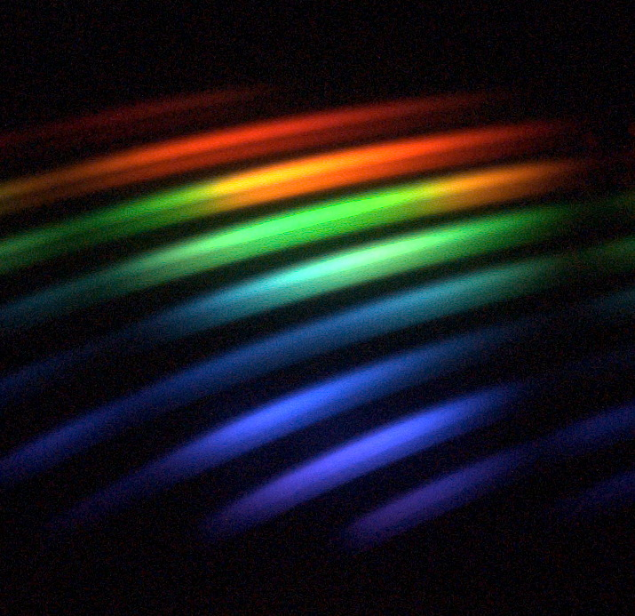

# unechelle - software control for amateur high-performance spectrometers
Reduces an echelle spectrograph image into an optical spectrum. The image is assumed to be formed from a collimated beam, dispersed by a prism and diffracted by a blazed high-order grating. When the input from a white LED gets somewhat blurred, it may look like this:

One needs an optical fibre with a mount, a collimating (~50mm) photographic lens, an optical prism, a 2" optical grating with 50-150 lines/mm blazed to as high angle as possible, and a (de-bayered) digital camera with a telephoto (~100-200mm) lens. And a computer with Python installed. The blazed grating is the only component that is hard to obtain, but sometimes one can be found e.g. on e-bay for less than $100-$200. Optical assembly takes several evenings, but it provides one with a spectrometer that can compete with professional $5000+ instruments.

Such a spectrometer setup has numerous advantages: elimination of overlapping diffraction orders (many higher orders are recorded, but thanks to the prism they never overlap), reduced sensitivity to polarisation minimum losses on grating (the grating operates near optimum blazing angle), low noise (the CCD/CMOS sensors and accompanying electronics of modern digital cameras have developed into excellent, yet inexpensive, light detectors; multiple image pixels can also be averaged perpendicular to the line), and high resolution (the image is crossed multiple times by the consecutive portions of the spectrum, easily getting over 20 000 pixels across visible spectrum). Particularly when the camera sensor is debayered, one can record whole UVB-optical-NIR spectrum in single shot.

What we shall get from this program is a calibrated curve of spectral intensity. 

For convenience, the program should be able to control digital cameras with *libgphoto*.

## installation and basic camera testing

Get the camera controlling modules for *python3*:

    sudo pip3 install -v gphoto2 
    sudo pip3 install -v rawkit 
    sudo pip3 install -v numpy 

Connect your camera to the computer, make sure both are on. 

	lsusb ## check that there is some device that could be your camera

Test the libgphoto2 module, also taking an image (useful for optical debug!)

	sudo python3 /usr/local/share/python-gphoto2/examples/preview-image.py  

## Some useful links

Camera sensor comparison, showing the second hand DSLRs are on par with much more expensive scientific cameras: http://www.clarkvision.com/articles/digital.sensor.performance.summary/

Debayering the CMOS sensor of a camera had almost no effect for visible-light sensitivity, since on the one hand it removes the color filters (good), but it also removes the microlens array (bad): https://stargazerslounge.com/topic/166334-debayering-a-dslrs-bayer-matrix/?page=10. Procedure for Canon 350D described here: https://www.lifepixel.com/tutorials/infrared-diy-tutorials/canon-rebel-xt-350d

Could the spectral range be possibly extended into the mid-IR through covering a part of the CMOS sensor by a thin https://en.wikipedia.org/wiki/Photon_upconversion layer?
