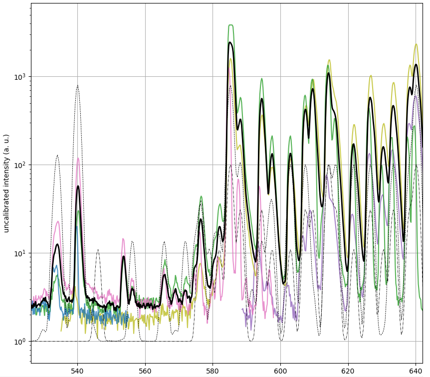

# unechelle - software control for amateur high-performance spectrometers
Reduces an echelle spectrograph image into an optical spectrum. The image is assumed to be formed from a collimated beam, dispersed by a prism and diffracted by a blazed high-order grating. When the input from a white LED gets somewhat blurred, it may look like this:


What we shall get from this program is a calibrated curve of spectral intensity. 

For convenience, the program should be able to control digital cameras with *libgphoto*.

## optical & mechanical setup

The optical path of the ray consists of 
1. a fibre with a mount, 
1. a collimating (~50mm) photographic lens (or a hollow mirror), 
1. a dispersive glass prism
1. a grating with 50-150 lines/mm, blazed to as high angle as possible
1. telephoto (~80-150mm) lens
1. and a digital camera, preferentially with the Bayer's color filter carefully scratched off the CMOS sensor.

Also needed is any reasonably powered computer with Linux&Python3. The blazed grating may be hard to obtain, but sometimes one can be found e.g. on e-bay for less than $100-$200. The same holds for the debayered camera. Optical assembly and tuning then takes several evenings, but it provides one with a spectrometer that can compete with professional $5000+ instruments.


Such a spectrometer setup has numerous advantages over a single-grating spectrometer: 
 * elimination of overlapping diffraction orders (many higher orders are recorded, but thanks to the prism they never overlap), 
 * minimum losses on grating and reduced sensitivity to polarisation (the grating operates near optimum angle given by the blazing), 
 * low noise (the CCD/CMOS sensors and accompanying electronics of modern digital cameras have developed into excellent, yet inexpensive, light detectors; multiple image pixels are also transversally averaged to further fight the noise), 
 * high resolution (the image is composed of multiple slightly overlapping portions of the spectrum, easily getting over 20 000 effective pixels across the CMOS). 
 * spectral width given by the silicon detector (particularly when the camera sensor is debayered, one can record whole UVB-optical-NIR spectrum in single shot.

A tentative bill of material (note that many other commercial suppliers exist): 
 * 0-100 €      Reused digital single-lens camera - Canon 350D (found or bought second-hand up to 100 €)
 *   5 €	lens adapter ring for the DSLR
 *  15 €	aftermarket AC power supply for the DSLR
 * 203 €	[https://www.thorlabs.com/newgrouppage9.cfm?objectgroup_id=1124](Echelle Grating 25 mm x 50 mm)  (best groove geometry needs to be established)
 * 304 €    2x [https://www.thorlabs.com/newgrouppage9.cfm?objectgroup_id=7002](Ø1" 90° Off-Axis Parabolic Mirror)
 * 103 €    [https://www.thorlabs.com/newgrouppage9.cfm?objectgroup_id=148](F2 Equilateral Dispersive Prism, 25 mm)
 *  80 €    [https://www.thorlabs.com/newgrouppage9.cfm?objectgroup_id=159](150x300 mm optical breadboard) (optional)
 *  20 €	3D-printing a box of black PLA (optional)
 * *sum = 650-750 €*

## installation and basic camera testing 

This procedure was tested on Ubuntu 18.04. It should be easily adapted for other linux distributions, and theoretically one should be able to run the scripts on other operating systems, too. 

1. Get the camera controlling modules for *python3*:

    sudo pip3 install -v gphoto2  # Failed on Ubuntu Bionic
    sudo pip3 install -v rawkit 
    sudo pip3 install -v numpy 

2. Connect your camera to the computer, make sure both are on. 

	lsusb ## check that there is some device that could be your camera

3. Test the ```libgphoto2``` module, also taking an image (useful for optical debug!)

	sudo python3 /usr/local/share/python-gphoto2/examples/preview-image.py  

4. If ```libgphoto2``` works, connect the fibre to a neon lamp (almost any AC-powered faint orange light will suffice). Use the following script to save *echelle* picture. You should be able to find it as a new .CR2/.RAW file in the ```image_logs/``` directory. Note this procedure will be updated in the next version of the project to be more user friendly.

	sudo python3 ./scripts/get_spectrum.py

5. Continue to manually assist the computer in interpreting the recorded image.  

	./scripts/gui_setup/gui_setup.py


Once the spectral orders are matched by corresponding curves, you can save the by clicking the ```Save parameters``` button. 


A detail on the optical spectrum follows; the dynamic range is roughly 500-1000, the effective spectral resolution < 2 nm in the visible range. Much better results can be expected from better stray-light shielding and carefully aligned optics. The coloured lines come from individual diffraction orders, the thick black line is the composite spectrum. Thin dashed and dash-dotted lines indicate a partial correspondence with the spectral lines tabulated by NIST and astrosurf.fr, respectively.




## camera debayering & some useful links

Camera sensor comparison, showing the Canon 350D or other second hand DSLRs are on par with (much more expensive) dedicated scientific cameras: http://www.clarkvision.com/articles/digital.sensor.performance.summary/

Removing the glass filter (guide here http://www.12dstring.me.uk/350dmod.htm) and the R-G-B-G color matrix (i.e., debayering, here https://www.lifepixel.com/tutorials/infrared-diy-tutorials/canon-rebel-xt-350d) significantly improves the wavelength range from UV to infrared. Debayering the CMOS sensor of a camera had almost no effect for visible-light sensitivity, since on the one hand it removed the color filters (good), but it also removed the microlens array (bad), as demonstrated https://stargazerslounge.com/topic/166334-debayering-a-dslrs-bayer-matrix/?page=10.

Ideas for future: Could the spectral range be possibly extended into the mid-IR through covering a part of the CMOS sensor by a thin https://en.wikipedia.org/wiki/Photon_upconversion layer? Could the microlens array be imprinted into a silicone mold, and then renewed using some UV-transparent resin? 
